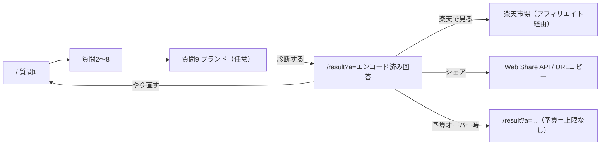
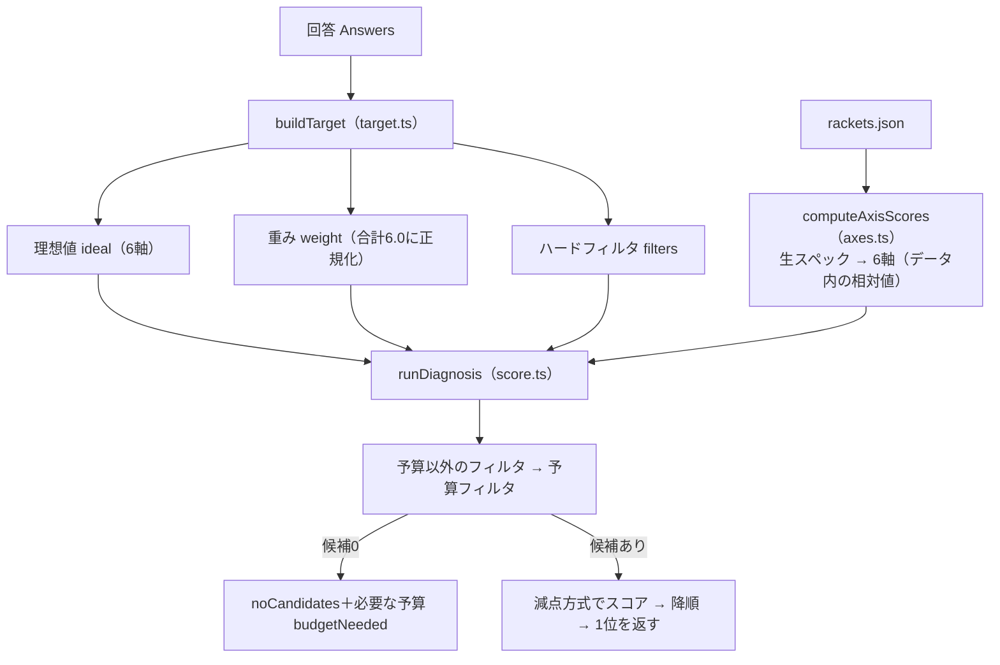

# racket-finder 設計書（現状版）

- 対象: https://github.com/kzkOasis/racket-finder （コミット `2e6ff63`）
- 公開URL: https://racket-finder-two.vercel.app/
- 位置づけ: **いま動いているコードをそのまま記述した設計書**。当初の指示書 `racket-finder-spec.md` とずれている箇所は「9. 仕様書との差分」にまとめた
- 改善の進め方は `docs/improvement-plan.md` を参照

---

## 1. 概要

9問の質問に答えると、ユーザーに合ったテニスラケットを提案する診断ツール。提案したラケットに楽天アフィリエイトリンクを付けて収益化する。

| 項目 | 内容 |
|---|---|
| 収益源 | 楽天アフィリエイト（Amazon の枠は用意済みだが URL は全件空） |
| 集客 | 検索流入（Search Console 登録済み）と、結果URLのシェア |
| バックエンド | なし。DB・API・ログインなし。すべて静的データとクライアント計算で完結 |

## 2. 技術構成

| 分類 | 採用技術 |
|---|---|
| フレームワーク | Next.js 16.3（App Router）/ React 19 / TypeScript |
| UI | Tailwind CSS v4 / shadcn/ui（`@base-ui/react` ベース）/ lucide-react |
| グラフ | Recharts（レーダーチャート） |
| テスト | Vitest（`src/lib/__tests__/`、11件） |
| ホスティング | Vercel（Hobby） |
| 環境変数 | `NEXT_PUBLIC_SITE_URL`（sitemap / robots で使用。本番は `https://racket-finder-two.vercel.app` が設定済み） |

> `AGENTS.md` にあるとおり、Next.js 16 は学習データと API が異なる箇所がある。実装時は `node_modules/next/dist/docs/` を確認すること。

## 3. ディレクトリ構成

```
src/
  app/
    layout.tsx               # 共通レイアウト・サイト全体のメタデータ・広告表記バナー
    page.tsx                 # 質問フォーム（9ステップ、クライアントコンポーネント）
    result/
      page.tsx               # 結果ページ（サーバー）: generateMetadata で動的タイトル
      ResultPageContent.tsx  # 結果の描画（クライアント）
    robots.ts / sitemap.ts
  components/
    QuestionStep.tsx         # 1問1画面の汎用コンポーネント（プログレスバー付き）
    ResultCard.tsx           # ラケットカード（画像・スペック・理由文・購入ボタン）
    AxisRadarChart.tsx       # 理想値とラケットの6軸を重ねたレーダーチャート
    ComparisonTable.tsx      # 比較表（※現在どこからも使われていない）
    ui/                      # shadcn/ui 生成物
  lib/
    types.ts                 # 型定義
    constants.ts             # 質問ごとの差分・倍率・フィルタ定数
    axes.ts                  # 生スペック → 6軸スコア
    target.ts                # 回答 → 理想値 / 重み / ハードフィルタ
    score.ts                 # フィルタ・スコアリング
    reason.ts                # 理由文テンプレート
    share.ts                 # 回答の URL エンコード / デコード、ブランド一覧
    __tests__/
  data/
    rackets.json             # ラケット 40 本
```

## 4. 画面設計

### 4.1 画面一覧

| パス | 画面 | レンダリング | 役割 |
|---|---|---|---|
| `/` | 質問フォーム | クライアント | 9問を1問ずつ表示。最終問で `/result?a=...` へ遷移 |
| `/result?a=...` | 診断結果 | メタデータはサーバー、本体はクライアント | 1位のラケット・レーダーチャート・シェアボタン |
| `/sitemap.xml` / `/robots.txt` | — | 静的 | sitemap には `/` のみ |

全ページ共通で、最上部に「本ページはアフィリエイト広告を含みます」を常時表示している（`layout.tsx`）。

### 4.2 画面遷移



### 4.3 質問一覧

| # | 質問 | 選択 | 効き方 |
|---|---|---|---|
| Q1 | テニス歴・レベル | 単一（4択） | 理想値と重みの基準 |
| Q2 | プレースタイル | 単一（3択） | 理想値に加算、重みに乗算 |
| Q3 | スイングの大きさ | 単一（3択） | 理想値に加算、重みに乗算 |
| Q4 | いま困っていること | 最大2つ | 加算・乗算（2つ目は倍率 ×1.5 固定）＋ハードフィルタ |
| Q5 | 肘・肩の不安 | 単一（3択） | 加算・乗算＋ハードフィルタ（RA・厚み・重量下限） |
| Q6 | いまのラケットの重さ | 単一（5択） | ハードフィルタのみ（重量レンジ） |
| Q7 | 張る予定のストリング | 単一（3択） | 理想値に加算のみ |
| Q8 | 予算の上限 | 単一（4択、初期値＝上限なし） | ハードフィルタ（価格） |
| Q9 | 気になるブランド | 複数・任意 | ハードフィルタ（ブランド） |

数値の詳細は `src/lib/constants.ts`（当初仕様書の第4章と同じ値）。

## 5. データ設計

### 5.1 ラケットデータ（`src/data/rackets.json`）

```ts
type RacketSpec = {
  id: string;            // "yonex-ezone-100-2024"
  brand: string;         // BRANDS のいずれか
  series: string;        // "EZONE"（多様化用。現状は未使用）
  model: string;
  year: number;
  weight: number;        // g
  balance: number;       // mm
  swingWeight: number;
  headSize: number;      // inch²
  ra: number;
  beamWidth: number;     // mm（最厚部）
  pattern: '16x19' | '16x20' | '18x20' | 'other';
  price: number;         // 参考価格（円・手入力）
  imageUrl: string;      // 空文字なら画像の代わりにブランド名を表示
  affiliateUrl: { rakuten: string; amazon: string };
  overrides?: Partial<AxisScores>;  // 現状どの機種にも未設定
};
```

データの状況（40本）:

| ブランド | 本数 |
|---|---|
| Yonex / Wilson / Head | 各8 |
| Babolat | 7 |
| Prince | 4 |
| Dunlop | 3 |
| Technifibre | 2 |

- `imageUrl`: 32本が tennis-warehouse.com（米国の小売店）の透かし入り画像、2本が us.yonex.com、6本が空
- `affiliateUrl.rakuten`: 全40本に設定済み。1本（EZONE 100）は楽天の個別商品ページ、39本は楽天の**検索結果ページ**へのアフィリエイトリンク
- `affiliateUrl.amazon`: 全件空（ボタンは出ない）
- `price`: 手入力の固定値。更新の仕組みはない

### 5.2 回答（`Answers`）とシェアURL

回答は `/result?a=` に**ハイフン区切りの9つの整数**としてエンコードする（`share.ts`）。

```
a = Q1 - Q2 - Q3 - Q4 - Q5 - Q6 - Q7 - Q8 - Q9
例: 1-0-1-1-0-2-1-3-0
```

| 位置 | 内容 | エンコード |
|---|---|---|
| 1〜3, 5〜7 | Q1〜Q3, Q5〜Q7 | 選択肢配列のインデックス |
| 4 | Q4 | 5つの困りごとのビットフラグ |
| 8 | Q8 | 予算インデックス（3＝上限なし） |
| 9 | Q9 | 7ブランドのビットフラグ（0＝こだわらない） |

- 8要素の旧形式も受け付ける（後方互換）
- **並び順を変えると既存のシェアURLが壊れる**。選択肢やブランドの追加は、配列の末尾に足すこと

## 6. 診断ロジック

`src/lib/` はすべて React 非依存の純粋関数。乱数は使わない（同じ入力なら同じ結果）。



### 6.1 6軸スコア（`axes.ts`）

各スペックを**データセット内の最小〜最大で 0〜100 に正規化**し、重み付き和で6軸を出す。式は当初仕様書 3.3 と同じ。データを足すと全機種のスコアが少しずつ動く点に注意。

### 6.2 ターゲット（`target.ts`）

1. Q1 で理想値・重みの基準を決める
2. Q2〜Q5・Q7 の差分を理想値に加算し、倍率を重みに掛ける
3. 理想値を 0〜100 にクランプし、重みを合計 6.0 に正規化する
4. フィルタを積む: Q4「回転がかからない」→ 18x20 を除外 / Q4「振り遅れる」→ 重量上限 / Q5 → RA・厚み・重量下限（痛みがある場合 285g 以上は**意図的な仕様**）/ Q6 → 重量レンジ / Q8 → 価格上限 / Q9 → ブランド

### 6.3 スコアリング（`score.ts`）

```
減点 = Σ 重み[軸] × ギャップ[軸]
ギャップ = 快適性・操作性・ボレーは「足りない分だけ」、パワー・コントロール・スピンは「差の絶対値」
適合度 = max(0, 100 − 減点 / 6.0)
```

- 予算で候補が0本になった場合は条件を勝手に緩めず、`budgetNeeded`（予算以外の条件を満たす最安値）を返す
- **現状は1位の1本だけを返す**（多様化で3本選ぶ処理は未実装）

### 6.4 理由文（`reason.ts`）

LLMは使わずテンプレートで生成する。重み上位2軸を取り、「◯◯を重視している方に向けて、△△な{モデル名}を選びました。…」を組み立てる。ラケット側のスコアは見ていない。

## 7. メタデータ・SEO・シェア

| 項目 | 現状 |
|---|---|
| サイト全体のタイトル・説明 | 「8問に答えるだけで…3本提案します」（`layout.tsx`） |
| 結果ページのタイトル | `generateMetadata` で1位のモデル名を入れて動的生成（例:「EZONE 100 がおすすめ」） |
| OGP画像 | なし。Xのカードは `summary` |
| `metadataBase` | 未設定 |
| `<html lang>` | `en` |
| sitemap | `/` のみ |
| シェアボタン | 対応端末では Web Share API、それ以外は URL をコピー |
| アクセス解析 | なし |

## 8. 法令・規約まわり

| 項目 | 状態 |
|---|---|
| ステマ規制の広告表記（ページ最上部に常時表示） | 対応済み |
| 購入ボタンの「PR」表記・`rel="sponsored"` | 対応済み |
| 肘の注記と「医療的助言ではない」旨 | 対応済み（Q5「痛みがある」のとき） |
| プライバシーポリシー・運営者情報 | なし |
| 商品画像の出所 | 他社小売サイトの画像を直接参照（改善計画 P0 を参照） |
| 楽天ウェブサービスのクレジット | APIは未使用のため現状は不要。API導入時に必要 |

## 9. 当初仕様書（`racket-finder-spec.md`）との差分

| 項目 | 仕様書 | 実装 |
|---|---|---|
| 問題数 | 8問 | 9問（Q9 ブランドを追加）。メタデータの説明文は「8問」のまま |
| 提案本数 | 3本（同一シリーズ除外の多様化） | 1本 |
| 比較表 | 3本の簡易比較表を表示 | コンポーネントはあるが未使用 |
| 予算オーバー時の文言 | 「◯◯円まで広げると3本見つかります」 | 「¥◯◯円まで広げると候補が見つかります」（¥と円が重複） |
| OGP | タイトルと画像を動的に設定 | タイトルのみ動的。画像なし |

## 10. テスト

`npm test`（Vitest）で仕様書第8章の10ケースを実行する（全件パス）。ただしテスト10（シリーズ重複なし）は、1本しか返さない現状では実質的に何も検証していない。

## 11. デプロイ

- GitHub の `main` へ push → Vercel が自動ビルド・公開
- 本番環境には環境変数 `NEXT_PUBLIC_SITE_URL` を設定する（未設定だと sitemap が `racket-finder.vercel.app` を指す）
- `next/font/google`（Geist）はビルド時に Google Fonts へアクセスする。Geist は欧文フォントのため、日本語は OS 標準フォントで表示されている
